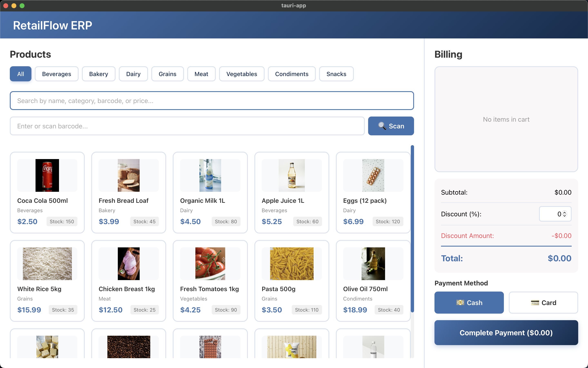

# 🛒 RetailFlow ERP

A modern, responsive Point of Sale (POS) system built with Tauri, React, and TypeScript for Windows desktop applications.



## ✨ Features

### Product Management

- **Category Filtering** - Quick navigation with category tabs (Beverages, Dairy, Meat, Vegetables, Snacks, Grains, Condiments, Bakery)
- **Real-time Search** - Search by product name, category, barcode, or price
- **Barcode Scanner Support** - Quickly add products via barcode scanning
- **Product Grid Display** - Visual product cards with images, prices, and stock levels
- **Stock Tracking** - Real-time inventory visibility

### Billing & Cart

- **Visual Cart Items** - Product thumbnails with quantity controls
- **Quantity Management** - Easy +/- buttons with remove option
- **Discount System** - Flexible percentage-based discounts
- **Payment Methods** - Support for Cash and Card payments
- **Real-time Totals** - Automatic calculation of subtotal, discount, and grand total

### User Experience

- **Responsive Design** - Adapts seamlessly from desktop to tablet layouts
- **Professional UI** - Clean design with ColorHunt palette (#3F72AF, #112D4E, #DBE2EF, #F9F7F7)
- **Scrollable Sections** - Independent scrolling for products and billing areas
- **Intuitive Controls** - Keyboard shortcuts and auto-focus for efficiency

## 🚀 Tech Stack

- **[Tauri](https://tauri.app/)** v2.9.4 - Lightweight desktop framework
- **[React](https://react.dev/)** v19.1.0 - UI library
- **[TypeScript](https://www.typescriptlang.org/)** - Type-safe development
- **[Vite](https://vitejs.dev/)** v7.0.4 - Fast build tool
- **[Rust](https://www.rust-lang.org/)** - Backend runtime

## 📦 Installation

### Prerequisites

- Node.js (v16 or higher)
- Rust (v1.70 or higher)
- npm or yarn

### Setup

1. **Clone the repository**

   ```bash
   git clone <repository-url>
   cd tauri-app
   ```

2. **Install dependencies**

   ```bash
   npm install
   ```

3. **Run in development mode**

   ```bash
   npm run tauri dev
   ```

4. **Build for production**
   ```bash
   npm run tauri build
   ```

## 🎯 Usage

### Adding Products to Cart

1. Browse products using category filters or search bar
2. Click on a product card to add it to cart
3. Or scan/enter barcode and click "Scan" button

### Managing Cart

- Use **+/-** buttons to adjust quantities
- Click **×** to remove items from cart
- Enter discount percentage in the discount field

### Checkout

1. Select payment method (Cash or Card)
2. Click "Complete Payment" button
3. Cart clears and transaction is complete

## 📁 Project Structure

```
tauri-app/
├── src/
│   ├── components/
│   │   ├── ProductsSection.tsx    # Product grid and search
│   │   └── BillingSection.tsx     # Cart and checkout
│   ├── data/
│   │   └── products.json          # Sample product database
│   ├── types/
│   │   └── index.ts               # TypeScript definitions
│   ├── App.tsx                    # Main layout
│   ├── App.css                    # Styling
│   └── main.tsx                   # Entry point
├── src-tauri/                     # Rust backend
├── public/                        # Static assets
└── package.json
```

## 🎨 Color Scheme

The application uses a professional ColorHunt palette:

- **Primary Blue**: `#3F72AF` - Buttons, accents, prices
- **Dark Navy**: `#112D4E` - Headers, text
- **Light Blue**: `#DBE2EF` - Borders, secondary elements
- **Off-White**: `#F9F7F7` - Backgrounds

## 🔧 Configuration

### Adding Products

Edit `src/data/products.json` to add/modify products:

```json
{
  "id": "1",
  "name": "Product Name",
  "price": 9.99,
  "category": "Category",
  "barcode": "1234567890",
  "stock": 100,
  "image": "image-url"
}
```

### Customizing Styles

Modify CSS variables in `src/App.css`:

```css
:root {
  --color-light: #f9f7f7;
  --color-secondary: #dbe2ef;
  --color-primary: #3f72af;
  --color-dark: #112d4e;
}
```

## 🖥️ System Requirements

### Development

- macOS, Windows, or Linux
- 4GB RAM minimum
- 500MB disk space

### Runtime

- Windows 7 or higher
- 2GB RAM minimum
- 100MB disk space

## 📱 Responsive Breakpoints

- **Desktop** (>1200px) - Full two-panel layout
- **Laptop** (1024px-1200px) - Optimized two-panel
- **Tablet** (<1024px) - Stacked layout
- **Mobile** (<768px) - Compact single column

## 🤝 Contributing

Contributions are welcome! Please feel free to submit a Pull Request.

## 📄 License

This project is open source and available under the [MIT License](LICENSE).

## 🙏 Acknowledgments

- Color palette from [ColorHunt](https://colorhunt.co/)
- Icons and design inspiration from modern POS systems
- Built with [Tauri](https://tauri.app/) framework

## 📞 Support

For issues and questions:

- Open an issue on GitHub
- Check existing documentation
- Review the code examples

## Recommended IDE Setup

- [VS Code](https://code.visualstudio.com/) + [Tauri](https://marketplace.visualstudio.com/items?itemName=tauri-apps.tauri-vscode) + [rust-analyzer](https://marketplace.visualstudio.com/items?itemName=rust-lang.rust-analyzer)

---

**Built with ❤️ using Tauri + React + TypeScript**
